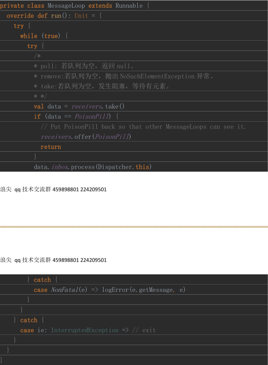

# Spark的RPC消息处理
## RPC通信的最后阶段，消息处理
Spark接收信息并没有立即处理，而已将加入消息队列，也是一个典型的生产消费模型。比如说：Driver端，会有很多个RPCEndPoint接收信息。
消息分发器根据RPCEndPoint的名字决定哪个EndPoint接收并处理消息。这样实现的通讯和解耦。避免RPC接收和处理的通讯阻塞。
### 1、生产者
RPC分为本地消息和远程的RPC请求
- 本地消息
    dispatch的postMessage消息队列加入
- 远程的RPC请求
    NetterRPCHandler，Receive 方法， Dispatcher加入消息队列

首先Dispatcher->hashMap->EndPointData
```
endpoints: ConcurrentMap[String, EndpointData] =
   new ConcurrentHashMap[String, EndpointData]
```
再调用postMessage ，根据名字调出EndPointData

然后 Enpoint->inBox[inBox->Message]
```
data. inbox .post(message)
val messages = w new java.util.LinkedList[InboxMessage]()
```
然后将 data 加入 receivers.offer(data)，receivers 负责跟踪存储那些有消息的 Endpoint。到此
生产消息算是结束。
### 2、消费者
Dispatcher 内部有一个固定线程数目的线程池

```
val numThreads = nettyEnv.conf.getInt("spark.rpc.netty.dispatcher.numThreads",
   Runtime.getRuntime.availableProcessors())
   val pool = ThreadUtils. newDaemonFixedThreadPool (numThreads,
   "dispatcher-event-loop")
```
线程池执行的线程对象是 MessageLoop。


消费处理的思路是从 receivers 里面取出有消息的 EndpointData，然后调用 inbox 对象的
process 方法。里面进行模式匹配，然后重点是调用了 receive 或者 receiveAndReply 方法。
```val data = receivers.take()
    data. inbox .process(Dispatcher.this)
```
### 3、消息存储
Dispatcher 的 receivers 负责存储有消息的 EndpointData。
InBox 的 messages 负责存储每个 Endpoint 的消息。
Dispatcher 的 endpoints 负责存储当前 RPC 服务所在处的所有 Endpoint。
Dispatcher 的 endpointsRef 负责存储所有 Endpointref。
其中，Endpoints 里面的所有 Endpoint 都是通过
```
override def setupEndpoint(name: String, endpoint: RpcEndpoint): RpcEndpointRef =
   {
   dispatcher.registerRpcEndpoint(name, endpoint)
   }
```

创建 RPCEndpoint 之后调用此方法加入的。