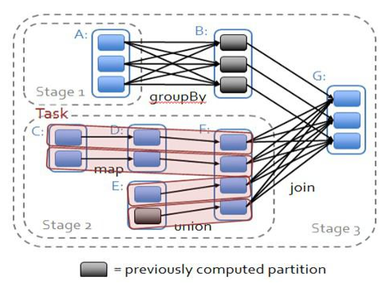
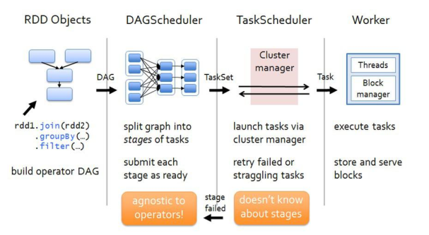

# Spark任务执行调度源码
- 1、Master，Worker，SparkSubmit,Driver,Executor之间的RPC关系
- 2、Driver和ExecutorRPC简历的具体过程和RPC的通信的细节
- 3、Spark 任务执行的大致流程及Stage划分需要了解的：窄依赖，宽依赖，ShuffleMapStage，ResultStage，ShuffleMapTask，ResultTask
- 4、Action产生任务到结果返回的大致流水讲解
- 5、Job生成提交及Stage划分
- 6、Task任务生成及调度
- 7、Task执行及结果返回

# Spark任务调度执行的过程
各个RDD直接存在着依赖关系，这些依赖关系形成有向无环图DAG，DAGScheduler对这些依赖关系形成的DAG，进行
Stage划分，划分的规则很简单，从后往前回溯，遇到窄依赖加入本stage，遇到宽依赖进行stage切分。完成了Stage的划分，
DAGScheduler基于每个Stage生成TaskSet，并将TaskSet提交给TaskSchedulerImpl。TaskSchedulerImpl负责具体的task
调度，在Workder节点上启动Task。

- 总结： Stage->DAGScheduler->TaskSet->TaskSchedulerImpl
#整个Stage划分任务调度用到的主要类
SparkDeploySchedulerBackend
CoarseGrainedSchedulerBackend
TaskSchedulerImpl
DAGScheduler
CoarseGrainedExecutorBackend
Executor
AppClient

#

# RPC调度过程相关源码
TaskDescription

SparkDeploySchedulerBackend

TaskSchedulerImpl

DAGScheduler

CoarseGrainedSchedulerBackend

CoarseGrainedExecutorBackend

Executor

AppClient

stage层面的调度策略，它会构建一个Stage的DAG，记录RDD及map Shuffle的输出，并且会构建最佳调度策略。

最终将stages封装成TaskSets交给TaskSchedulerImpl去执行。每个TaskSet包含若干相互独立的tasks。

stage的划分是依赖于Shuffle。对于窄依赖的RDD操作算子，会构建成pipeline。对于宽依赖或者叫Shuffle依赖的操作

会划分为两个stage，一个map，一个reduce。

看源码重要了解的点:

DAGScheduler决定了我们任务运行的优先位置。

job任务提交：通过action算子中调用submitJob提交给DAGScheduler

stage: Stage是以Shuffle进行划分的。stage有两种类型:ResultStage和ShuffleMapStage。stage有可能会被多个job复用。

task是独立运行的单元，一个task会被发往一台机器。

缓存及map输出的跟踪:DAGScheduler会记录那些RDD进行了缓存，避免重复计算。同样的也会跟踪Map Stage的输出
也是避免重复计算。

最佳位置:DAGScheduler会根据RDDs的的最佳运行位置或者数据的位置去决定task的最佳位置。

清除:会清除运行结束任务的所有数据结构，避免内存泄漏。

SparkContext.runJob中dagScheduler.runJob

DAGScheduler的submitJob向自身的消息循环体eventProcessLoop发送JobSubmitted消息

在handleJobSubmitted处理JobSubmitted消息

DAGScheduler->eventProcessLoop：jobSubmitted->handlerJobSubmitted：JobSubmitted处理